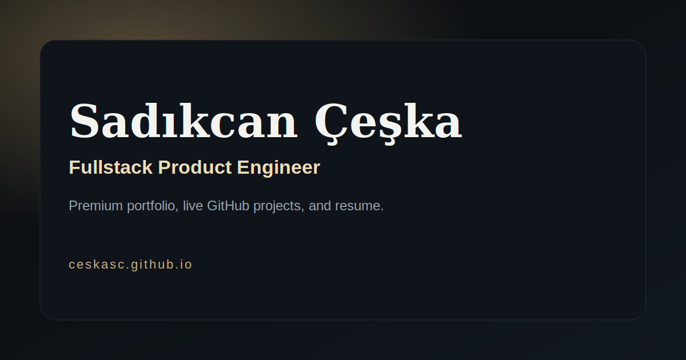

<div align="center">


# Sadikcan Ceska Portfolio

Premium, single-page portfolio experience built for **GitHub Pages**.  
Focused on visual quality, clean architecture, and live GitHub-powered project insights.

<p>
  <a href="https://ceskasc.github.io"></a>
  <a href="https://github.com/ceskasc/ceskasc.github.io"></a>
  <a href="https://github.com/ceskasc/ceskasc.github.io/stargazers"></a>
</p>

</div>

---

## Preview

<p align="center">
  
</p>

---

## Project Highlights

- Premium UI direction with custom typography, gradients, and motion.
- Live GitHub integration for profile and repository data.
- Snapshot fallback system for stable data delivery (`data/github.json`).
- Built-in resume viewer and downloadable PDF.
- Contact form that forwards messages to `kanalinizo@gmail.com`.
- SEO-ready setup: Open Graph, Twitter meta, JSON-LD, `robots.txt`, `sitemap.xml`.
- GitHub Actions automation for refreshing GitHub data every 6 hours.

---

## Tech Stack

<table>
  <tr>
    <td><strong>Frontend</strong></td>
    <td>HTML5, CSS3, Vanilla JavaScript</td>
  </tr>
  <tr>
    <td><strong>Hosting</strong></td>
    <td>GitHub Pages</td>
  </tr>
  <tr>
    <td><strong>Automation</strong></td>
    <td>GitHub Actions (`.github/workflows/update-github-data.yml`)</td>
  </tr>
  <tr>
    <td><strong>Data Source</strong></td>
    <td>GitHub REST API + static snapshot (`data/github.json`)</td>
  </tr>
  <tr>
    <td><strong>Form Delivery</strong></td>
    <td>FormSubmit</td>
  </tr>
</table>

---

## Repository Structure

```text
.
|-- index.html
|-- 404.html
|-- data/
|   `-- github.json
|-- .github/
|   |-- scripts/
|   |   `-- update-github-data.mjs
|   `-- workflows/
|       `-- update-github-data.yml
|-- logo-sc.svg
|-- og-image.svg
|-- Sadikcan-Ceska-CV.pdf
|-- robots.txt
|-- sitemap.xml
`-- site.webmanifest
```

---

## Running Locally

### Option 1: Direct open

Open `index.html` in your browser.

### Option 2: Local static server

```bash
python -m http.server 5500
```

Then visit: `http://localhost:5500`

---

## Deployment (GitHub Pages)

This repository is designed for **user site deployment** at:

`https://ceskasc.github.io`

To configure manually:

1. Go to `Settings > Pages`.
2. Set source to `Deploy from a branch`.
3. Select branch `main` and folder `/ (root)`.

---

## Data Refresh Automation

GitHub data snapshot is refreshed by workflow:

- File: `.github/workflows/update-github-data.yml`
- Script: `.github/scripts/update-github-data.mjs`
- Schedule: every 6 hours

The site load flow is:

1. Local cache
2. Static snapshot (`data/github.json`)
3. Live GitHub API

---

## Contact

- Email: `kanalinizo@gmail.com`
- Discord: `https://discord.gg/xz5fNAS3`
- GitHub: `https://github.com/ceskasc`

---

<div align="center">
  Built with intention by <strong>Sadikcan Ceska</strong>.
</div>
