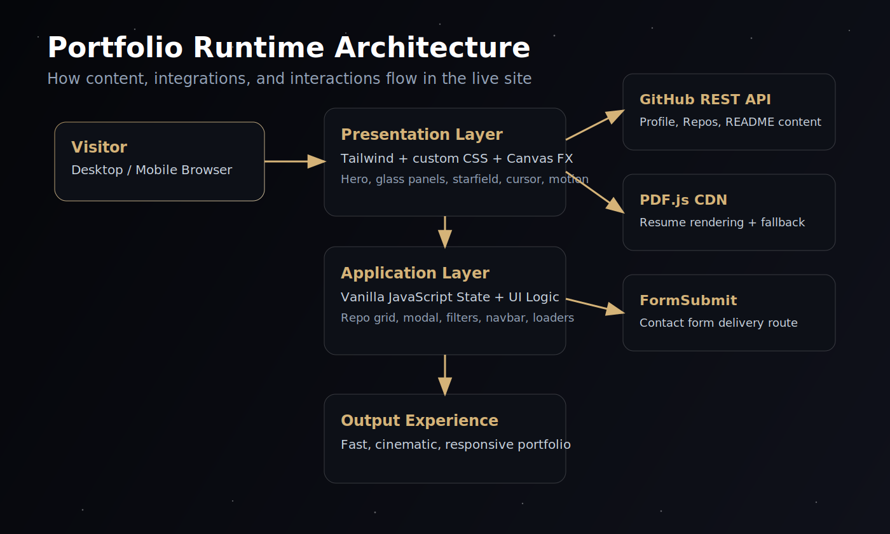



  

  <h1>Sadık Can Çeşka - Digital Architect Portfolio</h1>
  
<strong>Premium fullstack portfolio experience engineered for performance and crafted with a cinematic UI language.</strong>

  

    
    
    
    
  

  

    <a href="#experience-map">Experience Map</a> |
    <a href="#runtime-architecture">Architecture</a> |
    <a href="#local-usage">Local Usage</a> |
    <a href="#customization-guide">Customization</a>
  

## Identity and Intent

<table>
  <tr>
    <td width="50%" valign="top">
      <h3>What this project is</h3>
      

        A single-page personal portfolio for <strong>Sadık Can Çeşka</strong>, presenting product engineering capability,
        selected work, technical stack, and contact pathways.
      

      

        The site blends technical depth with premium interface presentation to position the author as a
        high-end fullstack product engineer.
      

    </td>
    <td width="50%" valign="top">
      <h3>Design direction</h3>
      <ul>
        <li><strong>Tone:</strong> Minimal, futuristic, high-contrast.</li>
        <li><strong>Theme:</strong> Void background with warm gold accent.</li>
        <li><strong>UI language:</strong> Glassmorphism, layered depth, ambient motion.</li>
        <li><strong>Brand feel:</strong> Technical precision + premium craftsmanship.</li>
      </ul>
    </td>
  </tr>
</table>

## Visual Language

<table>
  <tr>
    <th align="left">Token</th>
    <th align="left">Value</th>
    <th align="left">Usage</th>
  </tr>
  <tr>
    <td><code>void</code></td>
    <td><code>#030305</code></td>
    <td>Global background and depth base.</td>
  </tr>
  <tr>
    <td><code>accent</code></td>
    <td><code>#d5b378</code></td>
    <td>Primary CTA, highlights, focus accents.</td>
  </tr>
  <tr>
    <td><code>panel</code></td>
    <td><code>rgba(255,255,255,0.03)</code></td>
    <td>Glass cards and translucent surfaces.</td>
  </tr>
  <tr>
    <td><code>fonts</code></td>
    <td><code>Outfit / Playfair Display / Space Grotesk</code></td>
    <td>Modern sans + editorial serif + mono technical tone.</td>
  </tr>
</table>

## Experience Map

<table>
  <tr>
    <th align="left">Section</th>
    <th align="left">User Value</th>
    <th align="left">Implementation Notes</th>
  </tr>
  <tr>
    <td><strong>Hero</strong></td>
    <td>Instant personal brand impact and positioning.</td>
    <td>3D holographic code card, animated stars, live GitHub metrics.</td>
  </tr>
  <tr>
    <td><strong>Work</strong></td>
    <td>Fast validation of engineering output.</td>
    <td>GitHub API repo fetch, search, sort, capped grid, detail modal with README preview.</td>
  </tr>
  <tr>
    <td><strong>Resume</strong></td>
    <td>Quick background verification without leaving page flow.</td>
    <td>PDF.js rendering, direct download/open links, iframe fallback mode.</td>
  </tr>
  <tr>
    <td><strong>About / Stack</strong></td>
    <td>Tooling confidence and technical breadth.</td>
    <td>Dynamic stack chips sourced from in-page JS object.</td>
  </tr>
  <tr>
    <td><strong>Contact</strong></td>
    <td>Low-friction inbound lead capture.</td>
    <td>FormSubmit action, email route, Discord route.</td>
  </tr>
  <tr>
    <td><strong>404</strong></td>
    <td>Consistent brand even on failure path.</td>
    <td>Custom void-style 404 page with animated star canvas.</td>
  </tr>
</table>

## Runtime Architecture

  

<table>
  <tr>
    <th align="left">Layer</th>
    <th align="left">Role</th>
    <th align="left">Key Elements</th>
  </tr>
  <tr>
    <td><strong>Presentation</strong></td>
    <td>Visual language and perceived quality.</td>
    <td>Tailwind CDN config, custom CSS utilities, canvas starfield, blur/orb ambience.</td>
  </tr>
  <tr>
    <td><strong>Application</strong></td>
    <td>Interactive behavior and state updates.</td>
    <td>Vanilla JS modules for repo listing, modal, nav behavior, cursor, CV rendering.</td>
  </tr>
  <tr>
    <td><strong>Integrations</strong></td>
    <td>Live data and content delivery.</td>
    <td>GitHub REST API, PDF.js CDN, FormSubmit endpoint.</td>
  </tr>
</table>

## Runtime Integrations

<table>
  <tr>
    <th align="left">Service</th>
    <th align="left">What it powers</th>
    <th align="left">Reference</th>
  </tr>
  <tr>
    <td>GitHub REST API</td>
    <td>Profile metrics, repository grid, README modal content.</td>
    <td><code>https://api.github.com/users/ceskasc</code></td>
  </tr>
  <tr>
    <td>PDF.js</td>
    <td>In-page CV first-page render and fallback handling.</td>
    <td><code>cdnjs.cloudflare.com/ajax/libs/pdf.js/3.11.174/</code></td>
  </tr>
  <tr>
    <td>FormSubmit</td>
    <td>Contact form submission routing.</td>
    <td><code>https://formsubmit.co/...</code></td>
  </tr>
</table>

## Performance Decisions

<table>
  <tr>
    <th align="left">Decision</th>
    <th align="left">Benefit</th>
  </tr>
  <tr>
    <td><code>content-visibility: auto</code> on heavy sections</td>
    <td>Defers rendering work for off-screen content.</td>
  </tr>
  <tr>
    <td>Mobile-adjusted star count</td>
    <td>Reduces animation cost on smaller devices.</td>
  </tr>
  <tr>
    <td>Debounced <code>resize</code> handling for canvas</td>
    <td>Lowers resize-triggered reflow pressure.</td>
  </tr>
  <tr>
    <td>Transform-based animations</td>
    <td>Smoother GPU-friendly motion behavior.</td>
  </tr>
  <tr>
    <td>Hard limit on rendered repo cards</td>
    <td>Keeps initial project grid lightweight and fast.</td>
  </tr>
</table>

## SEO and Discoverability

  This repository includes baseline SEO artifacts for static deployment:

<ul>
  <li><code>robots.txt</code></li>
  <li><code>sitemap.xml</code></li>
  <li>semantic sections and metadata in <code>index.html</code></li>
  <li>custom <code>404.html</code> to preserve experience continuity</li>
</ul>

## Local Usage

<ol>
  <li>Clone the repository.</li>
  <li>Open <code>index.html</code> directly in browser or serve it with any static server.</li>
</ol>

<pre><code class="language-bash">git clone https://github.com/ceskasc/ceskasc.github.io.git
cd ceskasc.github.io
# Option A: open index.html directly
# Option B: serve locally
python -m http.server 8080
</code></pre>

## Customization Guide

  Most project-level personalization lives in <code>index.html</code>.

<table>
  <tr>
    <th align="left">What to customize</th>
    <th align="left">Where</th>
  </tr>
  <tr>
    <td>GitHub username and API source</td>
    <td><code>const username</code>, <code>const githubApiBase</code></td>
  </tr>
  <tr>
    <td>Resume file source</td>
    <td><code>const resumeFileName</code> + <code>Sadikcan-Ceska-CV.pdf</code></td>
  </tr>
  <tr>
    <td>Theme tokens and fonts</td>
    <td><code>tailwind.config</code> and custom CSS block</td>
  </tr>
  <tr>
    <td>Tech stack chips</td>
    <td><code>const techStack = [...]</code></td>
  </tr>
  <tr>
    <td>Contact endpoint</td>
    <td><code>&lt;form action="https://formsubmit.co/..."&gt;</code></td>
  </tr>
</table>

<pre><code class="language-js">// Primary personalization block in index.html
const username = "ceskasc";
const resumeFileName = "Sadikcan-Ceska-CV.pdf";
const githubApiBase = "https://api.github.com";
</code></pre>

## Project Structure

<pre><code>.
|-- index.html                 # Main page: structure, style, logic
|-- 404.html                   # Branded 404 experience
|-- README.md                  # This document
|-- data/
|   |-- readme-hero.svg        # README visual hero
|   `-- readme-architecture.svg # README architecture diagram
|-- Sadikcan-Ceska-CV.pdf      # Resume asset
|-- robots.txt                 # Crawl directive
|-- sitemap.xml                # Sitemap entries
`-- site.webmanifest           # Web app manifest
</code></pre>

## Deployment

  Static by design. Ideal for GitHub Pages deployment with no build step required.

<pre><code class="language-bash"># GitHub Pages target repository pattern
https://&lt;username&gt;.github.io/
</code></pre>

---

  Engineered for performance. Designed for impact.

